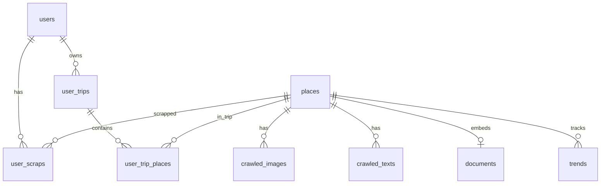

# LocalVibe DB 샘플 문서 (Notion용)

> 생성 시각(UTC): `2026-05-26T12:32:39.816910Z`  
> 로컬 MySQL 실조회 기준. 민감 정보(이메일 등)는 일부 마스킹.

원본 JSON(테이블별 최대 50행): [`db-sample-for-notion.json`](./db-sample-for-notion.json)

---

## 1. 테이블 관계 요약



## 2. 전체 현황

| 테이블 | 행 수 | 역할 |
|--------|------:|------|
| `crawled_images` | 0 | 네이버 블로그 등에서 받은 이미지 파일 메타 |
| `crawled_texts` | 29,520 | 블로그 크롤 본문·메타 |
| `documents` | 30 | 장소별 임베딩용 텍스트 + Pinecone ID |
| `places` | 12,025 | KTO·지역 관광지 마스터 (핵심) |
| `trends` | 30 | 장소·키워드별 스크랩/크롤 카운트 |
| `user_scraps` | 1 | 사용자 ♥ 스크랩 (place_id) |
| `user_trip_places` | 0 | 여행에 담긴 장소 + 순서 |
| `user_trips` | 0 | 사용자 여행 일정 헤더 |
| `users` | 2 | Google 로그인 사용자 |

### `places.insight_json.ktoImageUrl` 현황 (전체 12,025건)

| 구분 | 건수 |
|------|-----:|
| KTO 등 실 URL 있음 | 11,210 |
| 비어 있음 (프론트 placeholder 대상) | 815 |
| Unsplash placeholder | 0 |

`crawled_images` 행 수 0 → 현재 DB는 KTO URL 위주로 썸네일 표시.

---

## 3.1 `crawled_images`

**행 수:** 0
**PK:** `image_id`
**FK:** `place_id` → `places(place_id)`

### 컬럼

| 컬럼 | 타입 | NULL | PK |
|------|------|:----:|:--:|
| `image_id` | INTEGER |  | ✓ |
| `place_id` | BIGINT |  |  |
| `source_url` | VARCHAR(2048) | ✓ |  |
| `local_path` | VARCHAR(1024) | ✓ |  |
| `serve_url` | VARCHAR(1024) | ✓ |  |
| `crawled_at` | DATETIME | ✓ |  |

### 데이터 구성 메모
크롤 이미지 저장 경로·serve_url. 현재 DB는 비어 있음.

### 샘플 데이터 (최신순 최대 50건 중 **0건**)

_데이터 없음_

---

## 3.2 `crawled_texts`

**행 수:** 29,520
**PK:** `text_id`
**FK:** `place_id` → `places(place_id)`

### 컬럼

| 컬럼 | 타입 | NULL | PK |
|------|------|:----:|:--:|
| `text_id` | INTEGER |  | ✓ |
| `place_id` | BIGINT |  |  |
| `blog_url` | VARCHAR(2048) | ✓ |  |
| `blog_title` | VARCHAR(512) | ✓ |  |
| `blogger_name` | VARCHAR(256) | ✓ |  |
| `post_date` | VARCHAR(64) | ✓ |  |
| `description` | TEXT | ✓ |  |
| `content` | TEXT | ✓ |  |
| `content_length` | INTEGER | ✓ |  |
| `crawled_at` | DATETIME | ✓ |  |

### 데이터 구성 메모
장소별 네이버 블로그 크롤. `content`는 본문(길 수 있음). place_id로 places와 연결.

### 샘플 데이터 (최신순 최대 50건 중 **50건**)

| text_id | place_id | blog_title | blogger_name | post_date | content_length | blog_url |
| --- | --- | --- | --- | --- | --- | --- |
| 29520 | 12126 | 금촌동도서관 아이와 오기 좋은 곳 시립금촌도서관 놀거리 가득 | 섬뇨자:-) | 20251107 | 1196 | https://blog.naver.com/shw1220/224055079579 |
| 29519 | 12126 | 누구나 자유롭게 이용 가능한 '<b>금촌 청소년 문화의 집</b>' | 파주시청 | 20240731 | 2821 | https://blog.naver.com/paju_si/223531418131 |
| 29518 | 12126 | <b>파주시</b>의 문화교육시설! <b>금촌 청소년 문화의 집</b> | 파주시청 | 20220302 | 1274 | https://blog.naver.com/paju_si/222661779431 |
| 29517 | 12125 | <b>경기도</b>시공사와 함께한 '파주 <b>헤이리</b> 예술<b>마을</b> 건축<b>문화</b>답사' | GH공사 공식 블로그 | 20131018 | 3711 | https://blog.naver.com/gico12/20197683251 |
| 29516 | 12125 | 파주<b>헤이리</b>판아트페스티벌201... 속에서 <b>헤이리</b> 축제의 절정을...  | 헤이리를 살다! 모티프원 | 20150517 | 11933 | https://blog.naver.com/motif_1/220362090696 |
| 29515 | 12124 | <b>경기도</b> 안산 벚꽃명소 <b>화랑유원지</b> 아이와 가볼만한 공원 | 아이와 뭐하고 놀까? | 20260404 | 3989 | https://blog.naver.com/jungunoh/224240224252 |
| 29514 | 12124 | 안산 <b>화랑유원지</b> 벚꽃 명소 피크닉 추천 <b>경기도</b> 나들이 | 지구 위의 순간들 | 20260405 | 2097 | https://blog.naver.com/sumnino_/224241050014 |
| 29513 | 12124 | 안산 <b>화랑유원지</b> 공원 놀거리 주차장 <b>경기도</b> 피크닉 장소 | 지구 위의 순간들 | 20260522 | 1878 | https://blog.naver.com/sumnino_/224293490762 |
| 29512 | 12123 | <b>연천군</b> <b>열쇠전망대</b>, 고랑포구역사공원, 재인폭포 여행 | 구르미의 여행기술(Cloud's Art of Journey) | 20220726 | 2164 | https://blog.naver.com/power3603/222829904984 |
| 29511 | 12123 | 연천 안보<b>관광지 열쇠전망대</b> | 연천군공식블로그 | 20180227 | 0 | https://blog.naver.com/iyc21net/221218005467 |
| 29510 | 12122 | [파주가볼만한 곳] 산성의 속살을 볼 수 있는 겨울 <b>덕진산성</b> | 궈니파니님의 블로그 | 20260120 | 2375 | https://blog.naver.com/kwnipani/224153704651 |
| 29509 | 12122 | <b>경기도 파주시</b> DMZ <b>덕진산성</b> 생태 탐방 | 대자연의 신비한 여행 | 20241018 | 3377 | https://blog.naver.com/ckp4646/223623472924 |
| 29508 | 12122 | [파주 <b>덕진산성</b>],삼국 시대부터 조선을 지나 현대에 이르기까지...  | 궈니파니님의 블로그 | 20260524 | 1504 | https://blog.naver.com/kwnipani/224295296698 |
| 29507 | 12121 | <b>안성 맞춤랜드</b> - <b>보개면</b> - <b>안성시</b> - <b>경기도</b> | Unsent Letter To Me | 20251216 | 422 | https://blog.naver.com/dosivision/224111213051 |
| 29506 | 12121 | <b>안성 맞춤랜드</b> - <b>보개면</b> - <b>안성시</b> - <b>경기도</b> | Unsent Letter To Me | 20251216 | 423 | https://blog.naver.com/dosivision/224111222994 |
| 29505 | 12121 | <b>경기도 안성시 보개면 남사당로 198</b>-9(<b>안성맞춤랜드</b> 내) | 한재영교수 영원불멸천명무한 인생사랑 | 20230904 | 841 | https://blog.naver.com/hanjy1053002/223201585410 |
| 29504 | 12120 | 100대명산- 감악산250920일 | 君子不器, 信義不變 | 20251119 | 2053 | https://blog.naver.com/sik1472/224081438906 |
| 29503 | 12120 | 감악산 | 파주시 도시재생지원센터 | 20230824 | 1435 | https://blog.naver.com/paju_urc/223192458382 |
| 29502 | 12120 | 파주 감악산 등산코스 출렁다리 <b>운계폭포</b> 100대 명산 초보...  | 순간을 소중히 :) | 20260518 | 3026 | https://blog.naver.com/92186636/224289639076 |
| 29501 | 12119 | [<b>파주 이이 유적</b>] #내돈내방 #무료주차 #입장료 천원...  | Gabi&Mini | 20251206 | 2008 | https://blog.naver.com/gabi_mini/224099779524 |
| 29500 | 12119 | 가을 은행나무 추천 서울 <b>경기도</b> 명소 BEST 5 | 재테크와 투자 같이 공부합시다! | 20251011 | 2095 | https://blog.naver.com/silkroads/224037592090 |
| 29499 | 12119 | 파주 율곡선생유적지 (<b>파주 이이 유적</b>), 조선시대 대학자의...  | 드래곤의 세상풍경 | 20260522 | 2673 | https://blog.naver.com/dragondrs/224293312312 |
| 29498 | 12118 | 먹거리가 풍부하고, 가격도 착한 안양 &lt;<b>호계종합시장</b>&gt;을...  | 안양시 공식 블로그 | 20260402 | 1612 | https://blog.naver.com/tvanyanggokr/224238369319 |
| 29497 | 12118 | 경기 살리기 통큰 세일(최대 20%페이백, 최대 4회) | 앞니 아줌마의 육아일상 | 20260305 | 1591 | https://blog.naver.com/lovely_fronttheeth/224205235173 |
| 29496 | 12117 | 양주 초록지기 아로니아 축제와 마을둘러보기 | 양주에 미치다(클릭양주) | 20140905 | 2816 | https://blog.naver.com/yangjulove/220113994230 |
| 29495 | 12117 | 최고의 열매 아로니아 축제! <b>남면</b> 초록지기 마을에 다녀왔어요. | 양주에 미치다(클릭양주) | 20140831 | 4854 | https://blog.naver.com/yangjulove/220108626521 |
| 29494 | 12117 | 경기 <b>양주시</b> 일영유원지, 장흥<b>관광지</b> 등 여행지 | 숨은 명소 여행사전 | 20250226 | 6538 | https://blog.naver.com/step2korea/223774838444 |
| 29493 | 12116 | <b>옥정호수공원</b> 일대 일방통행 실시 (<b>옥정동로</b>1040-10)...  | 양주시 공식블로그 | 20241212 | 1081 | https://blog.naver.com/yangju619/223690381107 |
| 29492 | 12116 | <b>양주시</b> <b>옥정호수공원</b> 야경~산책(2025.9.29) | 지후와 함께 길°맛따라 주도락 | 20250930 | 647 | https://blog.naver.com/owkkra/224026439013 |
| 29491 | 12116 | <b>경기도</b> 데이트 가볼만한곳 양주 <b>옥정호수공원</b> 중앙공원...  | 모든 것은 나로부터 시작된다. | 20260518 | 1194 | https://blog.naver.com/from____ming/224289556088 |
| 29490 | 12115 | 겨울이 더 좋은 이천의 여행 명소…감성조차 색다른 체험의 고장 | Dr.Lee의 살아가는 이야기 | 20220103 | 2170 | https://blog.naver.com/lsj56/222610046312 |
| 29489 | 12114 | <b>경기도</b> 이천 &quot;코유&quot; / 이천 광주요 내 분위기 좋은 브런치...  | 이천 맛집 관고동 사랑방 | 20250515 | 1770 | https://blog.naver.com/cheolheelee9/223866334570 |
| 29488 | 12113 | 이천 쌀밥집 거리, 아주 상세히 설명합니다 | 이천소식 | 20180225 | 0 | https://blog.naver.com/dugongin/221216088601 |
| 29487 | 12113 | 이천 <b>도예촌 쌀밥거리</b> 이천돌솥밥 \| 한정식 맛집 웨이팅없이...  | always happy ♥ | 20240416 | 1685 | https://blog.naver.com/hgy1994/223417528167 |
| 29486 | 12113 | 쉬는 날 뭐 할까? <b>경기도</b> 이천 여행! | 레드 팩토리 | 20260428 | 1307 | https://blog.naver.com/jgy/224262468885 |
| 29485 | 12112 | 이천 만화 애니메이션을 한눈에 볼 수 있는 <b>청강만화역사박물관</b> | 이천시 공식 블로그 | 20260327 | 3582 | https://blog.naver.com/2000happy_/224225910271 |
| 29484 | 12112 | 서포터즈 \|  우리 만화의 역사가 한눈에 <b>청강만화역사박물관</b> | 이천시 공식 블로그 | 20260420 | 2315 | https://blog.naver.com/2000happy_/224249658340 |
| 29483 | 12112 | 만화역사박물관&lt;위치:<b>경기도 이천시 마장면 청강가창로</b>...  | 블로그로 국내여행 | 20180511 | 2977 | https://blog.naver.com/sato721/221273470882 |
| 29482 | 12110 | 여름방학에 꼭 가야할 곳이 있다면? 바로 이천 농촌체험마을 | 이천시 공식 블로그 | 20230816 | 4627 | https://blog.naver.com/2000happy_/223182212858 |
| 29481 | 12110 | 체험비 반값!  이천 농촌마을에서 혜택받고 놀자! | 이천시 공식 블로그 | 20250828 | 4423 | https://blog.naver.com/2000happy_/223985455225 |
| 29480 | 12110 | 마을&lt;위치:<b>경기도 이천시 대월면 대월로 358번길 168-24</b>...  | 블로그로 국내여행 | 20180508 | 2322 | https://blog.naver.com/sato721/221270866251 |
| 29479 | 12109 | <b>경기도</b> 여주 아이와 가볼만한곳 <b>은아목장</b> 어린이체험 | 캘 리 로 그 ♩ | 20260402 | 3160 | https://blog.naver.com/kallilogue/224238005434 |
| 29478 | 12109 | <b>경기도</b> 여주 가볼만한곳 아이와 여행 코스 Best4 | 찌미의 여행을 그리다 | 20260206 | 2688 | https://blog.naver.com/rdal89/224168045819 |
| 29477 | 12109 | <b>경기도</b> 여주 아기랑 가볼만한곳 <b>은아목장</b> 카페 낙농체험...  | 땅은블로그 | 20260411 | 1783 | https://blog.naver.com/dms4613/224249081247 |
| 29476 | 12108 | 혼자는 못해 선우용녀 양평 찜질방 3곳 위치 &amp; 솥뚜껑 닭볶음탕...  | 부티진영과 함께 보기 | 20260114 | 1747 | https://blog.naver.com/yeongland/224146021327 |
| 29475 | 12108 | <b>경기도</b> 양평 솥뚜껑 닭볶음탕 맛집 \| 서울 근교 찜질방 데이트...  | 합리적 선택을 도와드위요 | 20240331 | 2053 | https://blog.naver.com/seung2435/223400820246 |
| 29474 | 12108 | <b>경기도</b> 양평 솥뚜껑닭볶음탕 맛집 찜질방 등 놀거리 가볼만한곳 | 소바칸의 여행블로그 | 20241018 | 3104 | https://blog.naver.com/s600105/223624513767 |
| 29473 | 12107 | 〔양평여행〕 향토문화 탐방 지평 <b>수곡서원</b>(대사헌 권경우...  | 좋은사람(더세경) | 20231128 | 1710 | https://blog.naver.com/ssy700410/223276690672 |
| 29472 | 12107 | 양평 문화재탐방 권경우 묘역과 <b>수곡서원</b> | 양평군 공식 블로그 양평톡톡 | 20210421 | 1885 | https://blog.naver.com/yangpyeong63/222317958837 |
| 29471 | 12107 | 양평 <b>수곡서원</b>(楊平 水谷書院).경기 | * 푸른새벽, 바람처럼 떠나다 * | 20260313 | 1088 | https://blog.naver.com/queenkimms/224215428102 |

<details><summary>JSON 샘플 3건 (복사용)</summary>

```json
[
  {
    "text_id": 29520,
    "place_id": 12126,
    "blog_url": "https://blog.naver.com/shw1220/224055079579",
    "blog_title": "금촌동도서관 아이와 오기 좋은 곳 시립금촌도서관 놀거리 가득",
    "blogger_name": "섬뇨자:-)",
    "post_date": "20251107",
    "description": "시립금촌도서관 <b>경기도 파주시 시민회관길 40</b> 031-940-4381 영업시간 월-금 9:00-22:00 토 일 9:00-18:00 1,3,5째주 월요일 휴무 1층 <b>금촌청소년문화의집</b> 지난번에 한번 와봤기에 고민않고 바로 들어가는 금촌동도서관... ",
    "content": ":: 금촌동도서관 금촌도서관 ::​안녕하세요셀러봉입니다.​여름에 한번 와보고 가을이 되서 다시 한번 방문한금촌동도서관 시립금촌도서관주차는 금촌도서관 바로 앞20대 정도 가능하답니다.시립금촌도서관경기도 파주시 시민회관길 40시립금촌도서관경기도 파주시 시민회관길 40031-940-4381영업시간월-금 9:00-22:00토 일 9:00-18:001,3,5째주 월…",
    "content_length": 1196,
    "crawled_at": "2026-05-25 10:57:39"
  },
  {
    "text_id": 29519,
    "place_id": 12126,
    "blog_url": "https://blog.naver.com/paju_si/223531418131",
    "blog_title": "누구나 자유롭게 이용 가능한 '<b>금촌 청소년 문화의 집</b>'",
    "blogger_name": "파주시청",
    "post_date": "20240731",
    "description": "<b>금촌 청소년 문화의 집</b> <b>경기도 파주시 시민회관길 40</b> 1층 &lt;<b>금촌 청소년 문화의 집</b>&gt;은 지역 청소년들의 학업 외 성장에 필요한 활동을 위한 공간으로 청소년이라면 모든 시설을 무료로 이용할 수 있을 뿐만... ",
    "content": "\"평화로운 미래, 마을과 소통하는 청소년\"청소년들의 꿈과 열정이 피어나는 곳, 금촌 청소년 문화의 집!​2004년 민간 기관으로 출발한 <금촌 청소년 문화의 집>이파주시 공공기관 (재)파주시청소년재단에 위탁, 청소년이라면누구나 자유롭게 이용할 수 있는 지금의 청소년 수련 시설로 다시 문을 열었어요!​💛금촌 청소년 문화의 집, 함께 둘러볼까요?💛​금촌 청소년…",
    "content_length": 2821,
    "crawled_at": "2026-05-25 10:57:38"
  },
  {
    "text_id": 29518,
    "place_id": 12126,
    "blog_url": "https://blog.naver.com/paju_si/222661779431",
    "blog_title": "<b>파주시</b>의 문화교육시설! <b>금촌 청소년 문화의 집</b>",
    "blogger_name": "파주시청",
    "post_date": "20220302",
    "description": "<b>금촌청소년 문화의집</b>입니다. 위치는 <b>경기도 파주시 시민회관길 40</b>입니다. 이곳은 <b>파주 시</b>민으로 청소년이면 누구나 이용을 할 수 있는 곳이랍니다. 운영시간은 화요일부터 금요일까지는 오전 10시부터 오후... ",
    "content": "파주 청소년을 위한금촌 청소년 문화의 집안녕하세요.아이 키우기 좋은 도시경기도 파주시 블로그 정민두 기자입니다.​민족 최대 명절 설 연휴 즐겁게 보내셨나요?​예년처럼 집안의 모든 가족들이 한자리에 모여차례도 지내고, 세배도 했어야 하는데,올해는 강화된 사회적 거리두기로친척들이 모두 한곳에 모이지는 못했습니다.​장거리 이동이 쉽지 않은 지금,주말에 내가 살고…",
    "content_length": 1274,
    "crawled_at": "2026-05-25 10:57:37"
  }
]
```

</details>

---

## 3.3 `documents`

**행 수:** 30
**PK:** `doc_id`
**FK:** `place_id` → `places(place_id)`

### 컬럼

| 컬럼 | 타입 | NULL | PK |
|------|------|:----:|:--:|
| `doc_id` | INTEGER |  | ✓ |
| `place_id` | BIGINT |  |  |
| `title` | VARCHAR(512) | ✓ |  |
| `content` | TEXT | ✓ |  |
| `pinecone_id` | VARCHAR(128) | ✓ |  |
| `created_at` | DATETIME | ✓ |  |

### 데이터 구성 메모
Pinecone 벡터 검색용 문서. place당 1행(unique). `pinecone_id`는 임베딩 후 채움.

### 샘플 데이터 (최신순 최대 50건 중 **30건**)

| doc_id | place_id | title | pinecone_id | created_at |
| --- | --- | --- | --- | --- |
| 30 | 5819 | 강화 바다캠핑장에서의 특별한 1박 2일 | doc_30 | 2026-05-26 12:20:28 |
| 29 | 8854 | 화성 마도 맛집, 동원갈비 | doc_29 | 2026-05-26 12:18:49 |
| 28 | 1620 | CU 서귀포항점: 제주 여행의 새로운 핫플레이스 | doc_28 | 2026-05-26 12:18:36 |
| 27 | 8916 | 하남의 중식당 정온: 맛과 분위기를 동시에 즐길 수 있는 곳 | doc_27 | 2026-05-26 12:18:34 |
| 26 | 7855 | 부산의 숨은 보석, JSTAY 게스트하우스 | doc_26 | 2026-05-26 12:18:32 |
| 25 | 9200 | 평택 고덕의 숨은 맛집, 짬뽕나무 | doc_25 | 2026-05-26 12:08:27 |
| 24 | 7820 | 부산 해운대의 고급 한우 맛집, 일품한우 | doc_24 | 2026-05-26 12:01:02 |
| 23 | 829 | 천지연 걸매생태공원: 자연과 조류를 만나는 곳 | doc_23 | 2026-05-26 08:51:45 |
| 22 | 10872 | 카페 그루비: 광교 카페거리의 아늑한 북카페 | doc_22 | 2026-05-26 08:49:14 |
| 21 | 11533 | 경기도 광주, 남한산성의 힐링 카페 '카페 르방' | doc_21 | 2026-05-26 08:46:37 |
| 20 | 4842 | 서울 종로구의 숨바꼭질 게스트하우스 | doc_20 | 2026-05-26 08:30:14 |
| 19 | 10101 | 여주 강한사: 가을의 숨은 명소 | doc_19 | 2026-05-26 08:30:05 |
| 18 | 19 | 한생연 생명과학박물관: 생명 과학의 세계로의 초대 | doc_18 | 2026-05-26 08:22:34 |
| 17 | 813 | 고내포구: 제주 서쪽의 숨은 보석 | doc_17 | 2026-05-26 08:18:05 |
| 16 | 6299 | 대전의 숨은 보석, 우리들공원과 성심당 탐방 | doc_16 | 2026-05-26 08:17:57 |
| 15 | 7735 | 부산의 해양환경교육원, 해양환경공단을 방문하다 | doc_15 | 2026-05-26 08:12:41 |
| 14 | 12126 | 청소년의 꿈이 자라는 공간, 금촌청소년문화의집 | doc_14 | 2026-05-26 08:11:35 |
| 13 | 6298 | 대전의 전통 장어 맛집, 동서장어 | doc_13 | 2026-05-26 08:11:11 |
| 12 | 1970 | 여수의 숨은 보석, 향일암 | doc_12 | 2026-05-26 02:50:06 |
| 11 | 210 | 광주 서구의 매력적인 카페, 쟝리 6-6 | doc_11 | 2026-05-26 01:41:54 |
| 10 | 9572 | 이천의 숨은 맛집, 진미쌀밥 | doc_10 | 2026-05-19 11:22:36 |
| 9 | 115 | 대전의 맛, 농민순대 | doc_9 | 2026-05-19 05:31:50 |
| 8 | 10 | 롯데시티호텔 마포: 서울의 중심에서 만나는 편안함 | doc_8 | 2026-05-19 05:29:39 |
| 7 | 16 | 롯데백화점 본점 에비뉴엘: 쇼핑과 문화가 어우러진 공간 | doc_7 | 2026-05-19 05:04:46 |
| 6 | 11 | 롯데시티호텔 명동: 서울의 중심에서 만나는 편안함 | doc_6 | 2026-05-19 05:04:19 |
| 5 | 12 | 임피리얼 팰리스 부티크 호텔: 이태원의 숨은 보석 | doc_5 | 2026-05-19 05:02:59 |
| 4 | 752 | 전주 용강서원: 전통과 자연이 어우러진 곳 | doc_4 | 2026-05-19 04:58:28 |
| 3 | 883 | 서서울호수공원: 도심 속 자연의 쉼터 | doc_3 | 2026-05-19 04:55:43 |
| 2 | 111 | 대전어린이회관: 가족과 함께하는 즐거운 공간 | doc_2 | 2026-05-19 04:27:22 |
| 1 | 112 | 대전의 가성비 호텔, 호텔 인터시티 | doc_1 | 2026-05-19 04:26:43 |

<details><summary>JSON 샘플 3건 (복사용)</summary>

```json
[
  {
    "doc_id": 30,
    "place_id": 5819,
    "title": "강화 바다캠핑장에서의 특별한 1박 2일",
    "content": "인천광역시 강화군 화도면에 위치한 바다캠핑장은 자연과 함께하는 캠핑의 매력을 느낄 수 있는 곳입니다. 지난 추석 명절, 많은 사람들이 가족과 함께 이곳에서 1박 2일의 캠핑을 즐겼습니다. 날씨는 9월 30일 기준으로 최저 17도, 최고 22도로 쾌적했지만, 간헐적인 비 소식에 걱정이 앞섰습니다. 그러나 도착할 때쯤 해가 쨍쨍 떠서 기분이 좋았습니다.\n\n바다…",
    "pinecone_id": "doc_30",
    "created_at": "2026-05-26 12:20:28"
  },
  {
    "doc_id": 29,
    "place_id": 8854,
    "title": "화성 마도 맛집, 동원갈비",
    "content": "경기도 화성시 마도면 해운로 676에 위치한 '동원갈비'는 맛있는 갈비로 유명한 식당입니다. 이곳은 특히 회식 장소로 인기가 많아 많은 손님들이 방문합니다. 블로그 후기에 따르면, 사장님이 전통 계량 한복을 차려입고 단정한 모습으로 손님을 맞이하는 모습이 인상적입니다. 또한, 고기와 냉면의 조화가 뛰어나며, 고기를 주문하면 서비스로 추가 고기를 제공받기도 …",
    "pinecone_id": "doc_29",
    "created_at": "2026-05-26 12:18:49"
  },
  {
    "doc_id": 28,
    "place_id": 1620,
    "title": "CU 서귀포항점: 제주 여행의 새로운 핫플레이스",
    "content": "CU 서귀포항점은 제주특별자치도 서귀포시 칠십리로91번길에 위치한 매력적인 관광지입니다. 이곳은 제주 여행 중 편리하게 이용할 수 있는 편의점으로, 다양한 상품과 서비스를 제공하여 여행객들에게 큰 인기를 끌고 있습니다. 특히, 서귀포항 근처에 위치해 있어 바다를 즐기며 간편한 쇼핑을 할 수 있는 점이 매력적입니다.\n\nCU 서귀포항점은 제주도의 아름다운 자연…",
    "pinecone_id": "doc_28",
    "created_at": "2026-05-26 12:18:36"
  }
]
```

</details>

---

## 3.4 `places`

**행 수:** 12,025
**PK:** `place_id`

### 컬럼

| 컬럼 | 타입 | NULL | PK |
|------|------|:----:|:--:|
| `place_id` | BIGINT |  | ✓ |
| `content_id` | VARCHAR(128) | ✓ |  |
| `name` | VARCHAR(512) |  |  |
| `category` | VARCHAR(128) | ✓ |  |
| `region` | VARCHAR(256) | ✓ |  |
| `province` | VARCHAR(256) | ✓ |  |
| `address` | VARCHAR(1024) | ✓ |  |
| `latitude` | FLOAT | ✓ |  |
| `longitude` | FLOAT | ✓ |  |
| `description` | TEXT | ✓ |  |
| `source` | VARCHAR(256) | ✓ |  |
| `created_at` | DATETIME | ✓ |  |
| `insight_json` | TEXT | ✓ |  |

### 데이터 구성 메모
한국관광공사(KTO) 수집이 주.source·content_id·region·description + `insight_json`(ktoImageUrl, contentTypeId, recommendedBusinesses 등).

### 샘플 데이터 (최신순 최대 50건 중 **50건**)

| place_id | content_id | name | category | region | province | source | insight_json |
| --- | --- | --- | --- | --- | --- | --- | --- |
| 12126 | 752301 | 금촌청소년문화의집 | 레포츠 | 경기도 | 경기도 | 한국관광공사_국문 관광정보 서비스_GW | {"recommendedBusinesses": [], "busyHours": [], "targetCustomers": [], "contentTypeId": "28", "kto… |
| 12125 | 2654476 | 갤러리 MOA | 문화시설 | 경기도 | 경기도 | 한국관광공사_국문 관광정보 서비스_GW | {"recommendedBusinesses": [], "busyHours": [], "targetCustomers": [], "contentTypeId": "14", "kto… |
| 12124 | 2615489 | 화랑유원지 | 관광지 | 경기도 | 경기도 | 한국관광공사_국문 관광정보 서비스_GW | {"recommendedBusinesses": [], "busyHours": [], "targetCustomers": [], "contentTypeId": "12", "kto… |
| 12123 | 128575 | 열쇠전망대 | 관광지 | 경기도 | 경기도 | 한국관광공사_국문 관광정보 서비스_GW | {"recommendedBusinesses": [], "busyHours": [], "targetCustomers": [], "contentTypeId": "12", "kto… |
| 12122 | 2569487 | 덕진산성 | 관광지 | 경기도 | 경기도 | 한국관광공사_국문 관광정보 서비스_GW | {"recommendedBusinesses": [], "busyHours": [], "targetCustomers": [], "contentTypeId": "12", "kto… |
| 12121 | 2525563 | 안성맞춤랜드 | 관광지 | 경기도 | 경기도 | 한국관광공사_국문 관광정보 서비스_GW | {"recommendedBusinesses": [], "busyHours": [], "targetCustomers": [], "contentTypeId": "12", "kto… |
| 12120 | 125494 | 운계폭포 | 관광지 | 경기도 | 경기도 | 한국관광공사_국문 관광정보 서비스_GW | {"recommendedBusinesses": [], "busyHours": [], "targetCustomers": [], "contentTypeId": "12", "kto… |
| 12119 | 127691 | 파주 이이 유적 | 관광지 | 경기도 | 경기도 | 한국관광공사_국문 관광정보 서비스_GW | {"recommendedBusinesses": [], "busyHours": [], "targetCustomers": [], "contentTypeId": "12", "kto… |
| 12118 | 2773385 | 호계종합시장 | 쇼핑 | 경기도 | 경기도 | 한국관광공사_국문 관광정보 서비스_GW | {"recommendedBusinesses": [], "busyHours": [], "targetCustomers": [], "contentTypeId": "38", "kto… |
| 12117 | 129330 | 양주 초록지기마을 | 관광지 | 경기도 | 경기도 | 한국관광공사_국문 관광정보 서비스_GW | {"recommendedBusinesses": [], "busyHours": [], "targetCustomers": [], "contentTypeId": "12", "kto… |
| 12116 | 2751265 | 옥정호수공원 | 관광지 | 경기도 | 경기도 | 한국관광공사_국문 관광정보 서비스_GW | {"recommendedBusinesses": [], "busyHours": [], "targetCustomers": [], "contentTypeId": "12", "kto… |
| 12115 | 2713397 | 갤러리 더 화 | 문화시설 | 경기도 | 경기도 | 한국관광공사_국문 관광정보 서비스_GW | {"recommendedBusinesses": [], "busyHours": [], "targetCustomers": [], "contentTypeId": "14", "kto… |
| 12114 | 125576 | 지순택요(고려도요) | 관광지 | 경기도 | 경기도 | 한국관광공사_국문 관광정보 서비스_GW | {"recommendedBusinesses": [], "busyHours": [], "targetCustomers": [], "contentTypeId": "12", "kto… |
| 12113 | 612107 | 도예촌 쌀밥거리 | 관광지 | 경기도 | 경기도 | 한국관광공사_국문 관광정보 서비스_GW | {"recommendedBusinesses": [], "busyHours": [], "targetCustomers": [], "contentTypeId": "12", "kto… |
| 12112 | 2463869 | 청강 만화역사박물관 | 관광지 | 경기도 | 경기도 | 한국관광공사_국문 관광정보 서비스_GW | {"recommendedBusinesses": [], "busyHours": [], "targetCustomers": [], "contentTypeId": "12", "kto… |
| 12111 | 630652 | 이천 도니울명품쌀 정보화마을 | 관광지 | 경기도 | 경기도 | 한국관광공사_국문 관광정보 서비스_GW | {"recommendedBusinesses": [], "busyHours": [], "targetCustomers": [], "contentTypeId": "12", "kto… |
| 12110 | 128353 | 이천 자채방아마을 | 관광지 | 경기도 | 경기도 | 한국관광공사_국문 관광정보 서비스_GW | {"recommendedBusinesses": [], "busyHours": [], "targetCustomers": [], "contentTypeId": "12", "kto… |
| 12109 | 2021559 | 은아목장 | 관광지 | 경기도 | 경기도 | 한국관광공사_국문 관광정보 서비스_GW | {"recommendedBusinesses": [], "busyHours": [], "targetCustomers": [], "contentTypeId": "12", "kto… |
| 12108 | 1566740 | 양평 맑은숲캠프 | 관광지 | 경기도 | 경기도 | 한국관광공사_국문 관광정보 서비스_GW | {"recommendedBusinesses": [], "busyHours": [], "targetCustomers": [], "contentTypeId": "12", "kto… |
| 12107 | 1955902 | 수곡서원 | 관광지 | 경기도 | 경기도 | 한국관광공사_국문 관광정보 서비스_GW | {"recommendedBusinesses": [], "busyHours": [], "targetCustomers": [], "contentTypeId": "12", "kto… |
| 12106 | 2765216 | 대평지 | 관광지 | 경기도 | 경기도 | 한국관광공사_국문 관광정보 서비스_GW | {"recommendedBusinesses": [], "busyHours": [], "targetCustomers": [], "contentTypeId": "12", "kto… |
| 12105 | 2397543 | 모꼬지마을 | 관광지 | 경기도 | 경기도 | 한국관광공사_국문 관광정보 서비스_GW | {"recommendedBusinesses": [], "busyHours": [], "targetCustomers": [], "contentTypeId": "12", "kto… |
| 12104 | 2609813 | 파주 율곡습지공원 | 관광지 | 경기도 | 경기도 | 한국관광공사_국문 관광정보 서비스_GW | {"recommendedBusinesses": [], "busyHours": [], "targetCustomers": [], "contentTypeId": "12", "kto… |
| 12103 | 800630 | 양평 쌍겨리마을 | 관광지 | 경기도 | 경기도 | 한국관광공사_국문 관광정보 서비스_GW | {"recommendedBusinesses": [], "busyHours": [], "targetCustomers": [], "contentTypeId": "12", "kto… |
| 12102 | 631478 | 마나스아트센터 | 문화시설 | 경기도 | 경기도 | 한국관광공사_국문 관광정보 서비스_GW | {"recommendedBusinesses": [], "busyHours": [], "targetCustomers": [], "contentTypeId": "14", "kto… |
| 12101 | 2569501 | 스토리 미니어처 뮤지엄 | 문화시설 | 경기도 | 경기도 | 한국관광공사_국문 관광정보 서비스_GW | {"recommendedBusinesses": [], "busyHours": [], "targetCustomers": [], "contentTypeId": "14", "kto… |
| 12100 | 2547624 | 파크엘림 | 관광지 | 경기도 | 경기도 | 한국관광공사_국문 관광정보 서비스_GW | {"recommendedBusinesses": [], "busyHours": [], "targetCustomers": [], "contentTypeId": "12", "kto… |
| 12099 | 127027 | 죽산성지(이진터성지) | 관광지 | 경기도 | 경기도 | 한국관광공사_국문 관광정보 서비스_GW | {"recommendedBusinesses": [], "busyHours": [], "targetCustomers": [], "contentTypeId": "12", "kto… |
| 12098 | 2395755 | [경기옛길 영남길 제9길] 죽산성지순례길(죽산면소재지 ~ 일죽면 금산리) | 레포츠 | 경기도 | 경기도 | 한국관광공사_국문 관광정보 서비스_GW | {"recommendedBusinesses": [], "busyHours": [], "targetCustomers": [], "contentTypeId": "28", "kto… |
| 12097 | 2395756 | [경기옛길 영남길 제10길] 이천옛길(일죽면 금산리 ~ 어재연 장군 생가) | 레포츠 | 경기도 | 경기도 | 한국관광공사_국문 관광정보 서비스_GW | {"recommendedBusinesses": [], "busyHours": [], "targetCustomers": [], "contentTypeId": "28", "kto… |
| 12096 | 128549 | 최규서어서각 | 관광지 | 경기도 | 경기도 | 한국관광공사_국문 관광정보 서비스_GW | {"recommendedBusinesses": [], "busyHours": [], "targetCustomers": [], "contentTypeId": "12", "kto… |
| 12095 | 128302 | 안성 미리내마을 | 관광지 | 경기도 | 경기도 | 한국관광공사_국문 관광정보 서비스_GW | {"recommendedBusinesses": [], "busyHours": [], "targetCustomers": [], "contentTypeId": "12", "kto… |
| 12094 | 750959 | 바우덕이사당 | 관광지 | 경기도 | 경기도 | 한국관광공사_국문 관광정보 서비스_GW | {"recommendedBusinesses": [], "busyHours": [], "targetCustomers": [], "contentTypeId": "12", "kto… |
| 12093 | 128547 | 이해룡고가 | 관광지 | 경기도 | 경기도 | 한국관광공사_국문 관광정보 서비스_GW | {"recommendedBusinesses": [], "busyHours": [], "targetCustomers": [], "contentTypeId": "12", "kto… |
| 12092 | 2007741 | 소울원 | 관광지 | 경기도 | 경기도 | 한국관광공사_국문 관광정보 서비스_GW | {"recommendedBusinesses": [], "busyHours": [], "targetCustomers": [], "contentTypeId": "12", "kto… |
| 12091 | 125524 | 낙원역사공원 | 관광지 | 경기도 | 경기도 | 한국관광공사_국문 관광정보 서비스_GW | {"recommendedBusinesses": [], "busyHours": [], "targetCustomers": [], "contentTypeId": "12", "kto… |
| 12090 | 1960242 | 마석 5일장(3, 8일) | 쇼핑 | 경기도 | 경기도 | 한국관광공사_국문 관광정보 서비스_GW | {"recommendedBusinesses": [], "busyHours": [], "targetCustomers": [], "contentTypeId": "38", "kto… |
| 12089 | 129336 | 파주 산머루마을 | 관광지 | 경기도 | 경기도 | 한국관광공사_국문 관광정보 서비스_GW | {"recommendedBusinesses": [], "busyHours": [], "targetCustomers": [], "contentTypeId": "12", "kto… |
| 12088 | 2500685 | 대가농원 | 관광지 | 경기도 | 경기도 | 한국관광공사_국문 관광정보 서비스_GW | {"recommendedBusinesses": [], "busyHours": [], "targetCustomers": [], "contentTypeId": "12", "kto… |
| 12087 | 976598 | 남양주 구 팔당역 | 관광지 | 경기도 | 경기도 | 한국관광공사_국문 관광정보 서비스_GW | {"recommendedBusinesses": [], "busyHours": [], "targetCustomers": [], "contentTypeId": "12", "kto… |
| 12086 | 611647 | 미음나루터(미음나루 풍속마을) | 관광지 | 경기도 | 경기도 | 한국관광공사_국문 관광정보 서비스_GW | {"recommendedBusinesses": [], "busyHours": [], "targetCustomers": [], "contentTypeId": "12", "kto… |
| 12085 | 611704 | 파주 맛고을 음식문화거리 | 관광지 | 경기도 | 경기도 | 한국관광공사_국문 관광정보 서비스_GW | {"recommendedBusinesses": [], "busyHours": [], "targetCustomers": [], "contentTypeId": "12", "kto… |
| 12084 | 2653113 | 김포 사색의 길 | 관광지 | 경기도 | 경기도 | 한국관광공사_국문 관광정보 서비스_GW | {"recommendedBusinesses": [], "busyHours": [], "targetCustomers": [], "contentTypeId": "12", "kto… |
| 12083 | 2654544 | 아라마리나 해양아카데미 | 레포츠 | 경기도 | 경기도 | 한국관광공사_국문 관광정보 서비스_GW | {"recommendedBusinesses": [], "busyHours": [], "targetCustomers": [], "contentTypeId": "28", "kto… |
| 12082 | 2613637 | 일산 대화동 먹자골목 | 관광지 | 경기도 | 경기도 | 한국관광공사_국문 관광정보 서비스_GW | {"recommendedBusinesses": [], "busyHours": [], "targetCustomers": [], "contentTypeId": "12", "kto… |
| 12081 | 346634 | 용상사(파주) | 관광지 | 경기도 | 경기도 | 한국관광공사_국문 관광정보 서비스_GW | {"recommendedBusinesses": [], "busyHours": [], "targetCustomers": [], "contentTypeId": "12", "kto… |
| 12080 | 612796 | 풍동 애니골 | 관광지 | 경기도 | 경기도 | 한국관광공사_국문 관광정보 서비스_GW | {"recommendedBusinesses": [], "busyHours": [], "targetCustomers": [], "contentTypeId": "12", "kto… |
| 12079 | 2735308 | 정혜사 | 관광지 | 경기도 | 경기도 | 한국관광공사_국문 관광정보 서비스_GW | {"recommendedBusinesses": [], "busyHours": [], "targetCustomers": [], "contentTypeId": "12", "kto… |
| 12078 | 2735324 | 장안정사 | 관광지 | 경기도 | 경기도 | 한국관광공사_국문 관광정보 서비스_GW | {"recommendedBusinesses": [], "busyHours": [], "targetCustomers": [], "contentTypeId": "12", "kto… |
| 12077 | 3439364 | 케이트리 평택 호텔 | 숙박 | 경기도 | 경기도 | 한국관광공사_국문 관광정보 서비스_GW | {"recommendedBusinesses": [], "busyHours": [], "targetCustomers": [], "contentTypeId": "32", "kto… |

<details><summary>JSON 샘플 3건 (복사용)</summary>

```json
[
  {
    "place_id": 12126,
    "content_id": "752301",
    "name": "금촌청소년문화의집",
    "category": "레포츠",
    "region": "경기도",
    "province": "경기도",
    "address": "경기도 파주시 시민회관길 40",
    "latitude": null,
    "longitude": null,
    "description": "금촌청소년문화의집은(는) 경기도 파주시 시민회관길 40에 위치한 관광지입니다. (주소: 경기도 파주시 시민회관길 40)",
    "source": "한국관광공사_국문 관광정보 서비스_GW",
    "created_at": "2026-05-19 11:09:52",
    "insight_json": "{\"recommendedBusinesses\": [], \"busyHours\": [], \"targetCustomers\": [], \"contentTypeId\": \"28\", \"ktoImageUrl\": \"https://ton…"
  },
  {
    "place_id": 12125,
    "content_id": "2654476",
    "name": "갤러리 MOA",
    "category": "문화시설",
    "region": "경기도",
    "province": "경기도",
    "address": "경기도 파주시 탄현면 헤이리마을길 48-37",
    "latitude": null,
    "longitude": null,
    "description": "갤러리 MOA은(는) 경기도 파주시 탄현면 헤이리마을길 48-37에 위치한 관광지입니다. (주소: 경기도 파주시 탄현면 헤이리마을길 48-37)",
    "source": "한국관광공사_국문 관광정보 서비스_GW",
    "created_at": "2026-05-19 11:09:52",
    "insight_json": "{\"recommendedBusinesses\": [], \"busyHours\": [], \"targetCustomers\": [], \"contentTypeId\": \"14\", \"ktoImageUrl\": \"https://ton…"
  },
  {
    "place_id": 12124,
    "content_id": "2615489",
    "name": "화랑유원지",
    "category": "관광지",
    "region": "경기도",
    "province": "경기도",
    "address": "경기도 안산시 단원구 동산로 270 (초지동)",
    "latitude": null,
    "longitude": null,
    "description": "화랑유원지은(는) 경기도 안산시 단원구 동산로 270 (초지동)에 위치한 관광지입니다. (주소: 경기도 안산시 단원구 동산로 270 (초지동))",
    "source": "한국관광공사_국문 관광정보 서비스_GW",
    "created_at": "2026-05-19 11:09:52",
    "insight_json": "{\"recommendedBusinesses\": [], \"busyHours\": [], \"targetCustomers\": [], \"contentTypeId\": \"12\", \"ktoImageUrl\": \"https://ton…"
  }
]
```

</details>

---

## 3.5 `trends`

**행 수:** 30
**PK:** `trend_id`
**FK:** `place_id` → `places(place_id)`

### 컬럼

| 컬럼 | 타입 | NULL | PK |
|------|------|:----:|:--:|
| `trend_id` | INTEGER |  | ✓ |
| `place_id` | BIGINT |  |  |
| `keyword` | VARCHAR(256) | ✓ |  |
| `scrap_count` | INTEGER |  |  |
| `crawling_count` | INTEGER |  |  |
| `last_updated` | DATETIME | ✓ |  |

### 데이터 구성 메모
키워드·스크랩/크롤 횟수 집계(갤러리 점수 보조).

### 샘플 데이터 (최신순 최대 50건 중 **30건**)

| trend_id | place_id | keyword | scrap_count | crawling_count | last_updated |
| --- | --- | --- | --- | --- | --- |
| 30 | 5819 | 바다캠핑장 | 0 | 1 | 2026-05-26 12:20:18 |
| 29 | 8854 | 동원갈비 | 0 | 1 | 2026-05-26 12:18:40 |
| 28 | 1620 | CU 서귀포항점 | 0 | 1 | 2026-05-26 12:18:30 |
| 27 | 8916 | 정온 | 0 | 1 | 2026-05-26 12:18:24 |
| 26 | 7855 | JSTAY | 0 | 1 | 2026-05-26 12:18:13 |
| 25 | 9200 | 짬뽕나무 | 0 | 1 | 2026-05-26 12:08:14 |
| 24 | 7820 | 일품한우 | 0 | 1 | 2026-05-26 12:00:47 |
| 23 | 829 | 천지연 걸매생태공원 | 0 | 1 | 2026-05-26 08:51:36 |
| 22 | 10872 | 카페 그루비 | 0 | 1 | 2026-05-26 08:49:06 |
| 21 | 11533 | 카페 르방 | 0 | 1 | 2026-05-26 08:46:22 |
| 20 | 4842 | 숨바꼭질(Hide & Seek)(Hide & Seek (숨바꼭질) 게스트하우스) | 0 | 1 | 2026-05-26 08:30:08 |
| 19 | 10101 | 강한사 | 0 | 1 | 2026-05-26 08:29:54 |
| 18 | 19 | 한생연 생명과학박물관 | 0 | 1 | 2026-05-26 08:22:26 |
| 17 | 813 | 고내포구 | 0 | 1 | 2026-05-26 08:17:59 |
| 16 | 6299 | 우리들공원 | 0 | 1 | 2026-05-26 08:17:48 |
| 15 | 7735 | 해양환경공단 해양환경교육원(부산) | 0 | 1 | 2026-05-26 08:12:31 |
| 14 | 12126 | 금촌청소년문화의집 | 0 | 1 | 2026-05-26 08:11:25 |
| 13 | 6298 | 동서장어 | 0 | 1 | 2026-05-26 08:11:03 |
| 12 | 1970 | 향일암(여수) | 0 | 1 | 2026-05-26 02:49:55 |
| 11 | 210 | 쟝리 6-6 | 0 | 1 | 2026-05-26 01:41:45 |
| 10 | 9572 | 진미쌀밥 | 0 | 1 | 2026-05-19 11:22:30 |
| 9 | 115 | 농민순대 | 0 | 1 | 2026-05-19 05:31:45 |
| 8 | 10 | 롯데시티호텔 마포 | 0 | 1 | 2026-05-19 05:29:33 |
| 7 | 16 | 롯데백화점 본점 에비뉴엘 | 0 | 1 | 2026-05-19 05:04:42 |
| 6 | 11 | 롯데시티호텔 명동 | 0 | 1 | 2026-05-19 05:04:12 |
| 5 | 12 | 임피리얼 팰리스 부티크 호텔 | 0 | 1 | 2026-05-19 05:02:51 |
| 4 | 752 | 용강서원(전주) | 0 | 1 | 2026-05-19 04:58:19 |
| 3 | 883 | 서서울호수공원 | 0 | 1 | 2026-05-19 04:55:30 |
| 2 | 111 | 대전어린이회관 | 0 | 1 | 2026-05-19 04:27:16 |
| 1 | 112 | 호텔 인터시티 | 0 | 1 | 2026-05-19 04:26:26 |

<details><summary>JSON 샘플 3건 (복사용)</summary>

```json
[
  {
    "trend_id": 30,
    "place_id": 5819,
    "keyword": "바다캠핑장",
    "scrap_count": 0,
    "crawling_count": 1,
    "last_updated": "2026-05-26 12:20:18"
  },
  {
    "trend_id": 29,
    "place_id": 8854,
    "keyword": "동원갈비",
    "scrap_count": 0,
    "crawling_count": 1,
    "last_updated": "2026-05-26 12:18:40"
  },
  {
    "trend_id": 28,
    "place_id": 1620,
    "keyword": "CU 서귀포항점",
    "scrap_count": 0,
    "crawling_count": 1,
    "last_updated": "2026-05-26 12:18:30"
  }
]
```

</details>

---

## 3.6 `user_scraps`

**행 수:** 1
**PK:** `scrap_id`
**FK:** `user_id` → `users(user_id)`
**FK:** `place_id` → `places(place_id)`

### 컬럼

| 컬럼 | 타입 | NULL | PK |
|------|------|:----:|:--:|
| `scrap_id` | INTEGER |  | ✓ |
| `user_id` | INTEGER |  |  |
| `place_id` | BIGINT |  |  |
| `created_at` | DATETIME | ✓ |  |

### 데이터 구성 메모
로그인 사용자가 ♥ 한 place_id. (user_id, place_id) 유니크.

### 샘플 데이터 (최신순 최대 50건 중 **1건**)

| scrap_id | user_id | place_id | created_at |
| --- | --- | --- | --- |
| 1 | 1 | 883 | 2026-05-26 11:54:48 |

<details><summary>JSON 샘플 3건 (복사용)</summary>

```json
[
  {
    "scrap_id": 1,
    "user_id": 1,
    "place_id": 883,
    "created_at": "2026-05-26 11:54:48"
  }
]
```

</details>

---

## 3.7 `user_trip_places`

**행 수:** 0
**PK:** `entry_id`
**FK:** `trip_id` → `user_trips(trip_id)`
**FK:** `place_id` → `places(place_id)`

### 컬럼

| 컬럼 | 타입 | NULL | PK |
|------|------|:----:|:--:|
| `entry_id` | INTEGER |  | ✓ |
| `trip_id` | INTEGER |  |  |
| `place_id` | BIGINT |  |  |
| `sort_order` | INTEGER |  |  |
| `added_at` | DATETIME | ✓ |  |

### 데이터 구성 메모
trip에 포함된 place + `sort_order`.

### 샘플 데이터 (최신순 최대 50건 중 **0건**)

_데이터 없음_

---

## 3.8 `user_trips`

**행 수:** 0
**PK:** `trip_id`
**FK:** `user_id` → `users(user_id)`

### 컬럼

| 컬럼 | 타입 | NULL | PK |
|------|------|:----:|:--:|
| `trip_id` | INTEGER |  | ✓ |
| `user_id` | INTEGER |  |  |
| `name` | VARCHAR(255) |  |  |
| `created_at` | DATETIME | ✓ |  |

### 데이터 구성 메모
여행 이름(예: 제주 2박3일).

### 샘플 데이터 (최신순 최대 50건 중 **0건**)

_데이터 없음_

---

## 3.9 `users`

**행 수:** 2
**PK:** `user_id`

### 컬럼

| 컬럼 | 타입 | NULL | PK |
|------|------|:----:|:--:|
| `user_id` | INTEGER |  | ✓ |
| `google_id` | VARCHAR(128) |  |  |
| `email` | VARCHAR(255) |  |  |
| `name` | VARCHAR(255) | ✓ |  |
| `profile_image` | VARCHAR(1024) | ✓ |  |
| `created_at` | DATETIME | ✓ |  |
| `last_login_at` | DATETIME | ✓ |  |

### 데이터 구성 메모
Google OAuth 로그인 시 upsert.

### 샘플 데이터 (최신순 최대 50건 중 **2건**)

| user_id | google_id | email | name | created_at | last_login_at |
| --- | --- | --- | --- | --- | --- |
| 2 | 109865698014530484376 | iwillnotdo09@gmail.com | HYEONIL LIM | 2026-05-26 08:42:50 | 2026-05-26 08:42:50 |
| 1 | 104550612443228273953 | pickle.pkl3@gmail.com | 피클 | 2026-05-19 05:28:35 | 2026-05-26 08:43:05 |

<details><summary>JSON 샘플 3건 (복사용)</summary>

```json
[
  {
    "user_id": 2,
    "google_id": "109865698014530484376",
    "email": "iwillnotdo09@gmail.com",
    "name": "HYEONIL LIM",
    "profile_image": "https://lh3.googleusercontent.com/a/ACg8ocIZpIOUs1Mr3y_9m0cVSfYUA_5kLUmH78y5cfbvoKj5RByzFg=s96-c",
    "created_at": "2026-05-26 08:42:50",
    "last_login_at": "2026-05-26 08:42:50"
  },
  {
    "user_id": 1,
    "google_id": "104550612443228273953",
    "email": "pickle.pkl3@gmail.com",
    "name": "피클",
    "profile_image": "https://lh3.googleusercontent.com/a/ACg8ocJvVRf-bOZeFUyIFTz1goP1sMHCSuy3afIFOEwMx6VJ7SFI7w8=s96-c",
    "created_at": "2026-05-19 05:28:35",
    "last_login_at": "2026-05-26 08:43:05"
  }
]
```

</details>

---

## 4. Notion에 올릴 때 팁

1. 이 파일을 Notion 페이지에 **Import → Markdown** 하거나, 표만 복사해 붙여넣기.
2. 전체 50건이 필요하면 같은 폴더의 `db-sample-for-notion.json`을 참고.
3. `places`는 1.2만 건이라 Notion에는 **샘플 50 + 통계 표**만 올리는 것을 권장.
4. 재생성: `back`에서 DB 연결 후 `docs/db-sample-for-notion.json` 생성 스크립트 재실행(개발자에게 요청).
